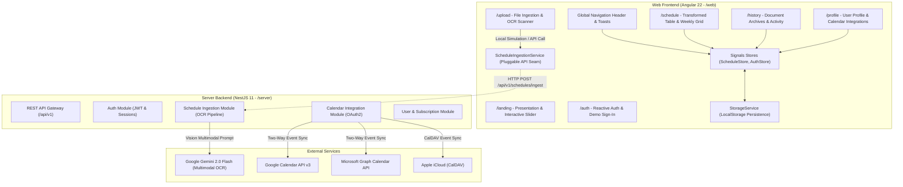

# Schedly — Agent Architecture & Engineering Guide

Welcome to the **Schedly** codebase. This document outlines the generalized architecture, component hierarchies, routing schemas, state strategies, and operational context for both the **Web Frontend** (`/web`) and **Server Backend** (`/server`).

---

## 1. System Overview & Monorepo Boundaries

Schedly is an AI-powered schedule digitization and calendar synchronization platform that transforms unstructured physical schedules (handwritten notes, printed university syllabi, hospital whiteboard rosters, conference brochures) into clean, editable digital calendars with instant two-way synchronization to Google Calendar, Microsoft Outlook, and Apple Calendar.



---

## 2. Web Frontend Architecture (`/web`)

The frontend is an **Angular 22** Single Page Application built on modern Angular paradigms: standalone components, signal-based reactivity, OnPush change detection, strictly typed reactive forms, and Tailwind CSS v4.

### 2.1 Vertical Slice & File-Based SRP Structure
The codebase follows **Vertical Slice Architecture** where domain concepts are cleanly isolated into feature slices. Every component, subcomponent, service, store, and model obeys the **Single Responsibility Principle (SRP)**:

```
web/src/app/
├── app.config.ts                         # Application providers, router scroll restoration, error listeners
├── app.routes.ts                         # Functional route definitions with semantic document titles
├── app.ts / app.html                     # Application root shell with header & toast container
├── core/                                 # Foundational singletons & domain models
│   ├── models/
│   │   ├── schedule-entry.model.ts       # ScheduleEntry, DayOfWeek, EventCategory types
│   │   ├── schedule-document.model.ts    # ScheduleDocument, DocumentStatus interfaces
│   │   └── user-profile.model.ts         # UserProfile, ConnectedCalendars, UserSubscription
│   ├── data/
│   │   └── initial-data.ts               # INITIAL_USER, SAMPLE_ENTRIES, PRESET_SAMPLE_TEMPLATES
│   ├── stores/
│   │   ├── schedule.store.ts             # Signal-based store for active schedule, documents, filtering
│   │   └── auth.store.ts                 # Signal-based store for user profile & auth status
│   └── services/
│       ├── storage.service.ts            # LocalStorage persistence with mock hydration fallback
│       ├── schedule-ingestion.service.ts # 4-step progressive OCR timeline & pluggable API adapter seam
│       └── ics-export.service.ts         # RFC 5545 compliant iCalendar (.ics) generator & download
├── layout/
│   └── header/
│       ├── header.component.ts           # Universal sticky header with responsive mobile drawer
│       └── header.component.html
├── shared/
│   ├── services/
│   │   └── toast.service.ts              # Reactive global toast notification dispatcher
│   └── components/
│       └── toast/
│           └── toast.component.ts        # Accessible ARIA live notification viewer
└── features/                             # Domain Feature Slices
    ├── landing/                          # Landing page & visitor introduction
    │   ├── landing-page.component.ts
    │   ├── landing-page.component.html
    │   └── components/
    │       ├── hero-section.component.ts        # Hero value prop & primary CTAs
    │       ├── interactive-preview.component.ts # Split before/after paper-to-digital slider
    │       ├── feature-grid.component.ts        # 3-step workflow explanation
    │       ├── preset-templates.component.ts    # 1-click test prototype cards
    │       ├── pricing-section.component.ts     # Free, Pro ($12/mo), Enterprise tiers
    │       └── landing-footer.component.ts      # Corporate footer with back-to-top
    ├── auth/                             # Authentication slice
    │   ├── auth-page.component.ts
    │   ├── auth-page.component.html
    │   └── components/
    │       ├── auth-form.component.ts           # Reactive form with typed email/password controls
    │       └── demo-login.component.ts          # 1-click Stanford faculty test profile
    ├── upload/                           # Ingestion engine slice
    │   ├── upload-page.component.ts
    │   ├── upload-page.component.html
    │   └── components/
    │       ├── file-dropzone.component.ts       # Drag & drop upload area with format badges
    │       ├── ingestion-progress.component.ts  # Progressive 4-stage OCR animation
    │       ├── upload-presets.component.ts      # Quick test templates on upload view
    │       └── ocr-guidelines.component.ts      # Tips for optimal photo clarity
    ├── schedule/                         # Transformed schedule workspace slice
    │   ├── schedule-view.component.ts
    │   ├── schedule-view.component.html
    │   └── components/
    │       ├── schedule-header.component.ts     # Status badge, title, export & sync triggers
    │       ├── schedule-stats.component.ts      # Summary metric pills (total, synced, types)
    │       ├── schedule-toolbar.component.ts    # Search, category filter, view switcher
    │       ├── schedule-table.component.ts      # Inline editable table with row sync/delete
    │       ├── schedule-grid.component.ts       # Weekly 7-day calendar column view
    │       └── add-event-modal.component.ts     # Reactive modal for custom event additions
    ├── history/                          # Document archive slice
    │   ├── history-page.component.ts
    │   ├── history-page.component.html
    │   └── components/
    │       ├── history-card.component.ts        # Archive document item card
    │       └── history-empty.component.ts       # Actionable empty state with upload CTA
    └── profile/                          # User settings & integrations slice
        ├── profile-page.component.ts
        ├── profile-page.component.html
        └── components/
            ├── user-details-card.component.ts   # Inline editable profile form & avatar
            ├── connected-calendars.component.ts # Google, Outlook, Apple toggle switches
            └── subscription-quota.component.ts  # Monthly parsing quota progress bar
```

### 2.2 Frontend Routing & Deep Linking Map

| Route Path | Component | Description & Key Capabilities |
| :--- | :--- | :--- |
| `/` | *Redirect to `/landing`* | Root redirect for visitor onboarding. |
| `/landing` | `LandingPageComponent` | Product hero, interactive split comparison slider, 3-step workflow, prototype presets, pricing matrix. |
| `/auth` | `AuthPageComponent` | Dual-mode Sign In / Sign Up reactive form, 1-click demo login, SOC-2 security badges. |
| `/upload` | `UploadPageComponent` | Drag-and-drop ingestion, format badges (JPG, PNG, PDF), 4-stage progressive OCR animation, preset pickers. |
| `/schedule` | `ScheduleViewComponent` | Active schedule workspace, inline editable table cells, weekly 7-day grid view, RFC 5545 .ICS export, Save & Sync. |
| `/history` | `HistoryPageComponent` | Archive of parsed documents, document sync status indicators, re-export, and deletion. |
| `/profile` | `ProfilePageComponent` | User profile details, Google Calendar / Outlook / Apple iCloud toggle switches, subscription quota progress. |
| `**` | *Redirect to `/landing`* | Fallback wild-card route. |

### 2.3 State Management & Reactivity
- **Signals-First Store**: Application state is managed via Angular Signals (`signal`, `computed`, `effect`) in `ScheduleStore` and `AuthStore`.
- **LocalStorage Hydration**: State is automatically persisted to `localStorage` and hydrated on boot via `StorageService`. If storage is empty, it seamlessly seeds with mock data (`INITIAL_USER`, `INITIAL_DOCUMENTS`).
- **Pluggable API Seam**: `ScheduleIngestionService` contains `startSimulatedIngestion` for client-side evaluation and an injectable `parseViaApi(file: File)` seam designed for direct backend connection.

---

## 3. Server Backend Architecture (`/server`)

The backend is built with **NestJS 11** on Node.js and TypeScript, organized into modular domain modules.

### 3.1 Target API Routing & Contract Specifications

All server endpoints follow RESTful conventions under the `/api/v1` namespace:

#### Authentication (`/api/v1/auth`)
- `POST /api/v1/auth/login` — Authenticates user credentials, returns JWT bearer token.
- `POST /api/v1/auth/register` — Creates a new account with default subscription quota.
- `GET /api/v1/auth/me` — Returns current authenticated user profile and permissions.

#### Schedule Ingestion & Management (`/api/v1/schedules`)
- `POST /api/v1/schedules/ingest` — Multi-part form upload (`image/png`, `image/jpeg`, `application/pdf`). Sends document buffer to Google Gemini 2.0 Flash Multimodal Vision API, returning structured JSON containing parsed `ScheduleEntry[]`.
- `GET /api/v1/schedules` — Lists all processed schedule documents for the authenticated user.
- `GET /api/v1/schedules/:id` — Fetches a single document and its schedule entries.
- `PATCH /api/v1/schedules/:id` — Updates document title or updates specific schedule entry fields inline.
- `DELETE /api/v1/schedules/:id` — Removes document from database and revokes synced calendar entries.
- `GET /api/v1/schedules/:id/export.ics` — Streams RFC 5545 `.ics` file for calendar imports.

#### Calendar Synchronization (`/api/v1/sync`)
- `POST /api/v1/schedules/:id/sync` — Pushes parsed events to connected Google Calendar (via Google Calendar v3 API) and Outlook (via Microsoft Graph).
- `DELETE /api/v1/schedules/:id/sync` — Unlinks and deletes synchronized events from external calendars.

#### User Profile & Quotas (`/api/v1/users`)
- `GET /api/v1/users/profile` — Retrieves user metadata, quota consumption, and calendar connection statuses.
- `PATCH /api/v1/users/profile` — Updates name, role, organization, or avatar.
- `PATCH /api/v1/users/integrations` — Updates connection tokens for Google Calendar, Outlook, and Apple iCloud.

---

## 4. Shared Domain Data Contracts

The frontend and backend communicate using shared TypeScript contracts:

```typescript
// Day of Week
export type DayOfWeek = 'Monday' | 'Tuesday' | 'Wednesday' | 'Thursday' | 'Friday' | 'Saturday' | 'Sunday';

// Event Classification
export type EventCategory = 'Academic' | 'Work Shift' | 'Meeting' | 'Lab / Workshop' | 'Personal' | 'Milestone';

// Single Schedule Item
export interface ScheduleEntry {
  id: string;
  name: string;
  day: DayOfWeek;
  date: string;       // YYYY-MM-DD
  startTime: string;  // HH:MM
  endTime: string;    // HH:MM
  location: string;
  category: EventCategory;
  notes?: string;
  isSynced?: boolean;
}

// Ingested Schedule Document
export interface ScheduleDocument {
  id: string;
  title: string;
  uploadedAt: string;
  sourceImageName: string;
  sourceImageUrl?: string;
  entriesCount: number;
  entries: ScheduleEntry[];
  status: 'analyzing' | 'processed' | 'synced';
}

// User Profile & Integrations
export interface UserProfile {
  name: string;
  email: string;
  role: string;
  organization: string;
  avatarUrl: string;
  connectedCalendars: {
    googleCalendar: boolean;
    outlookCalendar: boolean;
    appleCalendar: boolean;
  };
  subscription: {
    planName: string;
    tier: 'Free' | 'Pro' | 'Enterprise';
    status: 'Active' | 'Trial' | 'Past Due';
    renewsOn: string;
    parsedCount: number;
    parsedLimit: number;
  };
}
```

---

## 5. Design & Engineering Quality Rules for AI Agents

Whenever modifying, refactoring, or extending Schedly, AI agents **MUST** comply with the following four-tier guidelines:

### 5.1 The 4-Tier Product Design Hierarchy
1. **Tier 1: UX Strategy & Problem Framing (`product-designer`)**:
   - Maintain clear user journeys from document ingestion to calendar sync.
   - Respect route-level deep linking; never break browser navigation.
2. **Tier 2: Aesthetic Direction & Visual Identity (`frontend-design`)**:
   - Brand color: Primary `#1A365D`, hover `#2A4365`, background `#F8FAFC`.
   - Geometry: Sharp, professional `2px` border radius (`rounded-[2px]`).
   - Spatial rhythm: Multiples of 4px / 8px.
   - Shadows: Subtle material elevation tokens (`.elevation-1`, `.elevation-2`, `.elevation-3`).
3. **Tier 3: Anti-Slop Quality Gate & 5-State Completeness (`anti-ui-slop`)**:
   Every interactive component or slice **MUST** implement all 5 mandatory states:
   - **Initial State**: Default clean view with typographic balance.
   - **Loading State**: Progressive skeletons or progress bars matching layout geometry (`IngestionProgressComponent`).
   - **Empty State**: Contextual graphics with actionable CTA buttons (e.g. `HistoryEmptyComponent`, empty table filter resets).
   - **Error State**: Non-blocking inline alerts with clear recovery buttons.
   - **Filled / Success State**: Live feedback toasts for sync, save, and download actions.
4. **Tier 4: Technical Standards & Web Accessibility (`web-design-guidelines`)**:
   - WCAG 2.1 AA contrast ratio >= 4.5:1.
   - Visible keyboard focus rings (`*:focus-visible { outline: 2px solid #1A365D; outline-offset: 2px; }`).
   - Semantic HTML elements (`<header>`, `<nav>`, `<main>`, `<table>`, `<th>`, `<button>`).
   - Accessible ARIA roles (`role="switch"`, `role="status"`, `aria-live="polite"`).

### 5.2 Verification Commands
Before concluding any feature or refactoring task, agents must execute and verify:
```bash
# Frontend Unit Tests
cd /home/dej/Projects/projectx/schedly/web && pnpm run test --watch=false

# Frontend Production Build
cd /home/dej/Projects/projectx/schedly/web && pnpm run build

# Backend Tests & Build
cd /home/dej/Projects/projectx/schedly/server && pnpm run test && pnpm run build
```
